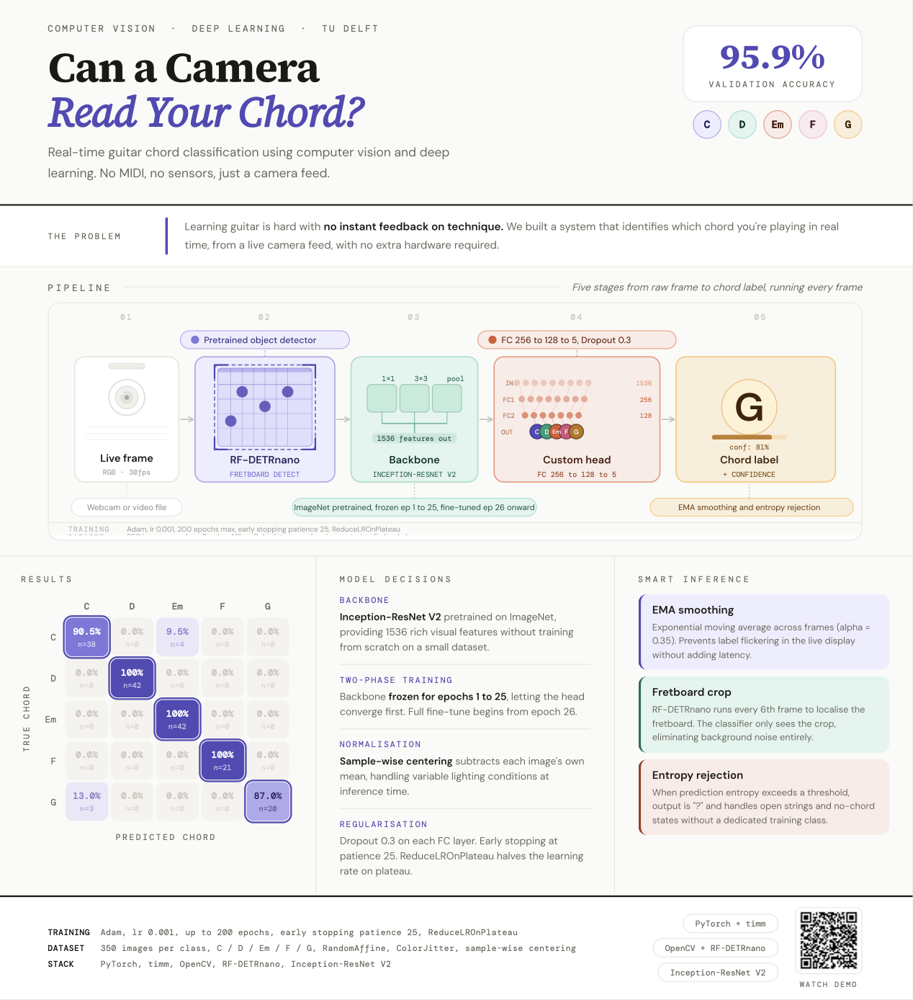

# Guitar Chord CV Pipeline

A complete **computer vision pipeline** for real-time guitar chord classification. The system detects the guitar fretboard via a Roboflow workflow, crops the region of interest, and classifies the chord using a fine-tuned **Inception-ResNet V2** model.

## 🔗 Project Links

- 📝 **Blog Post:** [Read the full breakdown](https://hackmd.io/@TYK1sX42RPeQsysSd9jVxg/BJf2L1hsWg)
- 🎥 **Live Demo:** [Watch the system in action](https://drive.google.com/file/d/1ty-b1mIPJI87yHAxNZSCeTcJQATcjx7w/view?usp=drive_link)
- 📦 **Dataset:** [Download / Explore dataset](https://www.kaggle.com/datasets/jasraj312/guitar-chords-fretboard-crop-dataset-5-classes)

---

## Poster



## Repository Contents

| File | Description |
|------|-------------|
| `dataset.ipynb` | Fretboard detection & train/val dataset preparation |
| `model_training.ipynb` | Model architecture definition, training, and validation |
| `model_inference.ipynb` | Evaluation on held-out data — per-person accuracy & confusion matrix |
| `Gradcam Model Inference.ipynb` | Grad-CAM visualisation of model attention on inference samples |
| `demo.py` | Live real-time demo (webcam, video file, or screen capture) |
| `fretboard_detector.py` | Standalone script: run Roboflow fretboard detection on a single image |
| `requirements.txt` | All Python dependencies for the full pipeline |

---

## ⚠️ Before You Start — Required Configuration

**Every file in this repository contains placeholder values that must be replaced with your own paths and credentials before running.** The sections below list exactly what to change in each file.

> **API keys are never committed to this repository.** Replace every `[ENCRYPTION_KEY]` / `[API_KEY]` placeholder with your actual Roboflow API key and keep it out of version control (see [Keeping secrets safe](#keeping-secrets-safe)).

---

### `dataset.ipynb` — Paths & Credentials to Set

Open **Cell 1** (the configuration cell) and update:

| Variable | What to set |
|----------|-------------|
| `ROBOFLOW_API_KEY` | Your Roboflow API key |
| `RAW_DATA_DIR` | Path to your raw images folder (subfolders named by chord class, e.g. `C/`, `D/`) |
| `PROCESSED_DATA_DIR` | Destination folder for the cropped `train/` & `val/` output |
| `TRAIN_SPLIT` | Fraction of images used for training (e.g. `0.8` for 80/20 split) |

Also check **Cell 5** and **Cell 7** if you are using a different Roboflow workspace or workflow:

```python
workspace_name = "test-kpcsq"    # ← replace with your workspace
workflow_id    = "find-fretboards"  # ← replace with your workflow ID
api_url        = "http://localhost:9001/"  # or https://serverless.roboflow.com
```

---

### `model_training.ipynb` — Paths to Set

Open **Cell 0** and update:

| Variable | What to set |
|----------|-------------|
| `DATA_DIR` | Path to the processed dataset produced by `dataset.ipynb` (must contain `train/` and `val/`) |

Example:
```python
DATA_DIR = Path("dataset/processed_dataset_heavy")  # ← update to your actual path
```

Also check **Cell 10** to confirm the output weights filename:
```python
# The model is saved as best_model.pth (or similar) — verify this matches
# what you set in model_inference.ipynb and demo.py
```

Tunable hyperparameters in **Cell 10** (adjust to your hardware & dataset):

| Variable | Default | Description |
|----------|---------|-------------|
| `BATCH_SIZE` | `32` | Batch size for training |
| `EPOCHS` | `200` | Number of training epochs |
| `LEARNING_RATE` | `0.001` | Adam optimiser learning rate |

---

### `model_inference.ipynb` — Paths to Set

Open **Cell 1** and update:

| Variable | What to set |
|----------|-------------|
| `WEIGHTS_PATH` | Path to your trained `.pth` weights file (output of `model_training.ipynb`) |

```python
WEIGHTS_PATH = 'chord_classifier_weights_test_new.pth'  # ← update to your weights file
```

Open **Cell 3** and update:

| Variable | What to set |
|----------|-------------|
| `TEST_DATA_DIR` | Path to your test data (structure: `person_name/chord_class/images`) |
| `CLASS_NAMES` | Must match the classes used during training (e.g. `['C', 'D', 'Em', 'F', 'G']`) |

```python
TEST_DATA_DIR = Path("dataset/fd_processed/")  # ← update to your test data path
CLASS_NAMES   = ['C', 'D', 'Em', 'F', 'G']    # ← update if your classes differ
```

---

### `Gradcam Model Inference.ipynb` — Paths to Set

Open **Cell 1** and update (same as `model_inference.ipynb`):

| Variable | What to set |
|----------|-------------|
| `WEIGHTS_PATH` | Path to your trained `.pth` weights file |
| `TEST_DATA_DIR` | Path to your test data (same structure as above) |
| `CLASS_NAMES` | Must match training classes |

Per-chord Grad-CAM cells also have:

| Variable | What to set |
|----------|-------------|
| `TARGET_TRUE_CLASS` | Chord to visualise (e.g. `'C'`, `'D'`, `'Em'`) |
| `TARGET_YOUTUBER` | Person subfolder name to filter on, or `None` for all |
| `TARGET_PRED_CLASS` | Filter by predicted class, or `None` to show all predictions |
| `SAVE_PATH` | File path to save the figure (e.g. `"gradcam_C.png"`), or `None` to just show |

---

### `demo.py` — Config to Set

Edit the constants at the top of the file (around line 24):

| Constant | What to set |
|----------|-------------|
| `WEIGHTS_PATH` | Path to your trained `.pth` weights file |
| `CLASS_NAMES` | Must match the classes used during training |
| `ROBOFLOW_KEY` | Your Roboflow API key (replace `[ENCRYPTION_KEY]`) |
| `WORKSPACE` | Your Roboflow workspace name |
| `WORKFLOW_ID` | Your Roboflow workflow ID |
| `ROBOFLOW_URL` | `"http://localhost:9001"` (local Docker) or `"https://serverless.roboflow.com"` |

---

### `fretboard_detector.py` — Config to Set

Edit the variables at the top of the file:

| Variable | What to set |
|----------|-------------|
| `IMAGE_PATH` | Path to the input image (e.g. `"my_guitar.jpg"`) |
| `ROBOFLOW_API_KEY` | Your Roboflow API key (replace `[ENCRYPTION_KEY]`) |
| `workspace_name` | Your Roboflow workspace name |
| `workflow_id` | Your Roboflow workflow ID |

---

## Installation

```bash
pip install -r requirements.txt
```

> `mss` is only needed for the `--screen` mode of `demo.py`.

---

## Pipeline Overview

Run the following **in order** when building the full pipeline from scratch:

```
dataset.ipynb  →  model_training.ipynb  →  model_inference.ipynb  →  demo.py
```

| Step | File | Main Output |
|------|------|-------------|
| 1 | `dataset.ipynb` | Cropped images in `train/` & `val/` |
| 2 | `model_training.ipynb` | `chord_classifier_weights_heavy.pth` |
| 3 | `model_inference.ipynb` | Per-person accuracy metrics & confusion matrix |
| 4 | `Gradcam Model Inference.ipynb` | Grad-CAM attention heatmaps |
| 5 | `demo.py` | Live chord detection window |

All notebooks must be run with the **project root** as the working directory unless you change every path to absolute paths.

---

## 1. `dataset.ipynb` — Fretboard Detection & Dataset Preparation

**Purpose:** Send raw chord images through a Roboflow fretboard-detection workflow, crop each detected fretboard (with configurable padding), and write results into `train/` and `val/` subdirectories in an `ImageFolder`-compatible layout.

**Dependencies:** `opencv-python`, `inference-sdk`, `supervision`, `pathlib`, `os`, `random`, `re`

**Expects:** Folders named by chord class containing raw `.jpg`/`.png` images  
**Produces:** Cropped `train/<class>/` and `val/<class>/` images at `PROCESSED_DATA_DIR`

Images with **no detection** are skipped and counted as failures. Helper cells toward the end can fix naming inconsistencies or class-balance issues.

---

## 2. `model_training.ipynb` — Architecture & Training

**Purpose:** Load the processed dataset, define the `GuitarChordClassifier` model, train and validate it, plot metrics, and save the best weights.

**Architecture:**
```
inception_resnet_v2 backbone (timm, pretrained)
  → AdaptiveAvgPool2d → Flatten
  → Linear(256) → ReLU → Dropout(0.3)
  → Linear(128) → ReLU → Dropout(0.3)
  → Linear(num_classes)
```

**Device:** auto-selects CUDA → CPU  
**Dependencies:** `torch`, `torchvision`, `timm`, `numpy`, `matplotlib`, `scikit-learn`

Run **after** `dataset.ipynb` has populated the processed train/val directories.

---

## 3. `model_inference.ipynb` — Evaluation on New Data

**Purpose:** Load the saved checkpoint, run inference on a held-out test set, aggregate per-person and global accuracy, and display a confusion matrix.

**Test data layout expected:**
```
TEST_DATA_DIR/
  person_name/
    chord_class/   ← must match CLASS_NAMES
      image1.jpg
      ...
```

**Device:** auto-selects CUDA → MPS → CPU  
**Dependencies:** `torch`, `torchvision`, `timm`, `numpy`, `matplotlib`, `scikit-learn`, `Pillow`

---

## 4. `Gradcam Model Inference.ipynb` — Grad-CAM Visualisation

**Purpose:** Use Grad-CAM to generate attention heatmaps showing which regions of the fretboard the model focuses on when making predictions, alongside confusion matrix evaluation.

**Note:** MPS is not supported by `pytorch-grad-cam`; use CUDA or CPU.

**Dependencies:** `torch`, `torchvision`, `timm`, `grad-cam`, `opencv-python`, `numpy`, `matplotlib`, `scikit-learn`, `Pillow`

---

## 5. `demo.py` — Live Real-Time Demo

### Usage

```bash
# Webcam (default — camera 0)
python demo.py

# Video file
python demo.py --source guitarr.mp4

# Video file with output saved
python demo.py --source guitarr.mp4 --save

# Skip fretboard detection — classify full frame
python demo.py --no-roboflow

# Screen capture mode (requires mss)
python demo.py --screen
```

### Roboflow Inference Server

The demo connects to a locally running Roboflow Inference Docker server. Start it with:

```bash
# CPU
docker run -p 9001:9001 roboflow/roboflow-inference-server-cpu

# GPU
docker run --gpus all -p 9001:9001 roboflow/roboflow-inference-server-gpu
```

Then set `ROBOFLOW_URL = "http://localhost:9001"` in `demo.py`.  
Alternatively, use `"https://serverless.roboflow.com"` for the cloud API (requires internet and counts against your plan quota).

### Key Optimisations

- **In-memory detection** — no temp-file I/O between frames and the SDK
- **Frame downscaling** — detection runs on frames scaled to ≤640px wide
- **Throttled detection** — Roboflow runs every 6 frames; classification runs every frame
- **EMA probability smoothing** — eliminates prediction flicker
- **Hysteresis gate** — committed chord requires a margin lead before switching
- **Entropy uncertainty** — outputs `?` when the model is unsure
- **`torch.compile()`** — applied automatically on PyTorch ≥ 2.0

**Dependencies:** `torch`, `timm`, `opencv-python`, `numpy`, `inference-sdk`, `supervision`, `mss` (optional)

---

## 6. `fretboard_detector.py` — Standalone Fretboard Detector

A minimal script that runs fretboard detection on a **single image** and saves the cropped results to disk.

```bash
python fretboard_detector.py
```

Detected crops are saved as `crop_0.jpg`, `crop_1.jpg`, etc.

**Dependencies:** `inference-sdk`, `supervision`, `opencv-python`

---

## Keeping Secrets Safe

This repo contains **no API keys**. All secrets have been replaced with `[ENCRYPTION_KEY]` / `[API_KEY]` placeholders.

**Recommended approach — use a `.env` file (already in `.gitignore`):**

```bash
# .env  (never commit this file)
ROBOFLOW_API_KEY=your_actual_key_here
```

Then load it in Python:
```python
import os
from dotenv import load_dotenv
load_dotenv()
ROBOFLOW_API_KEY = os.getenv("ROBOFLOW_API_KEY")
```

Install `python-dotenv` with:
```bash
pip install python-dotenv
```

Alternatively, set the key as an environment variable in your shell:
```bash
export ROBOFLOW_API_KEY="your_actual_key_here"
```

---

## Folder Structure (Expected)

```
CV_Proj/
├── final_code/                         ← this repo
│   ├── dataset.ipynb
│   ├── model_training.ipynb
│   ├── model_inference.ipynb
│   ├── Gradcam Model Inference.ipynb
│   ├── demo.py
│   ├── fretboard_detector.py
│   ├── requirements.txt
│   ├── .gitignore
│   └── README.md
├── dataset/
│   ├── raw/                            ← raw images organised by chord class
│   │   ├── C/
│   │   ├── D/
│   │   └── ...
│   └── processed_dataset_heavy/        ← output of dataset.ipynb
│       ├── train/
│       └── val/
└── chord_classifier_weights_heavy.pth  ← output of model_training.ipynb (not committed)
```

> Model weights (`.pth` files) and dataset folders are excluded by `.gitignore` and must be downloaded or generated locally.

---

## Quick Reference

```bash
# Install dependencies
pip install -r requirements.txt

# 1. Prepare dataset
jupyter notebook dataset.ipynb

# 2. Train the model
jupyter notebook model_training.ipynb

# 3. Evaluate
jupyter notebook model_inference.ipynb

# 4. Visualise attention
jupyter notebook "Gradcam Model Inference.ipynb"

# 5. Run live demo
python demo.py
```

---

## Team Contributions

This project was a highly collaborative effort, with all three team members contributing equally across the entire pipeline. 

* **Jasraj Anand, Nikshith Menta, and Sara Cortez** shared the dataset collection and annotation equally. 
* Two members filmed self-recorded chord examples under various conditions to ensure dataset diversity, while all three sourced and labeled frames from YouTube videos. 
* The model structure, training process, and ablation experiments were developed together as a unified team. 
* The development of the live demo, inference features (including EMA smoothing and entropy rejection), and the comprehensive blog write-up were divided collaboratively among the group.
